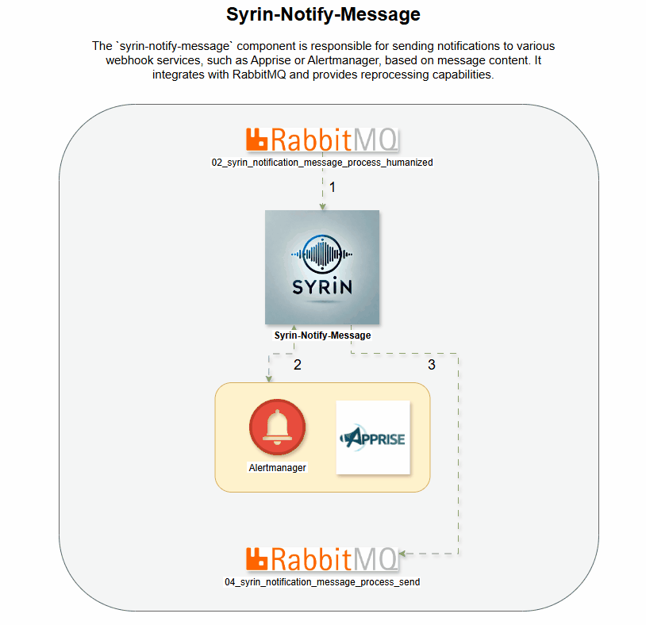

# syrin-notify-message

The `syrin-notify-message` component is responsible for sending notifications to various webhook services, such as Apprise or Alertmanager, based on message content. It integrates with RabbitMQ and provides reprocessing capabilities.

## Demo

## Table of Contents
- [Installation](#installation)
- [Environment Variables](#environment-variables)
- [Functionality](#functionality)
- [Queue Declarations](#queue-declarations)
- [Logging](#logging)
- [License](#license)

## Installation

Ensure that RabbitMQ is configured and accessible. For full installation details, refer to the [SYRIN Installation Repository](https://github.com/syrin-alert/syrin-install).

## Environment Variables

Set the following environment variables to configure RabbitMQ and webhook settings:

### RabbitMQ Settings

- `RABBITMQ_HOST`: RabbitMQ server address.
- `RABBITMQ_PORT`: Port for RabbitMQ server (default: `5672`).
- `RABBITMQ_VHOST`: Virtual host in RabbitMQ.
- `RABBITMQ_USER`: Username for RabbitMQ authentication.
- `RABBITMQ_PASS`: Password for RabbitMQ authentication.
- `RABBITMQ_TTL_DLX`: Time-to-live in ms for dead-letter queue (default: `60000`).

### Webhook Settings

- `WEBHOOK_TYPE`: Webhook type for notifications (`apprise` or `alertmanager`).
- `WEBHOOK_BASE_URL`: Base URL for the webhook service.
- `WEBHOOK_PORT`: Port for the webhook service.

## Functionality

This script performs the following tasks:

1. Connects to RabbitMQ with credentials from environment variables.
2. Processes messages by formatting and sending them to the designated webhook service.
3. Routes messages for reprocessing if the webhook notification fails.

### Queue Declarations

The following queues are managed in RabbitMQ:

- `02_syrin_notification_message_process_humanized`: Processes humanized notification messages.
- `02_syrin_notification_message_reprocess_humanized`: Handles reprocessing for failed messages.
- `04_syrin_notification_message_process_send`: Sends successfully processed messages.

## Logging

Logging is set at the INFO level with `pika` logs set to WARNING to reduce verbosity.

## License

This project is licensed under the MIT License.
