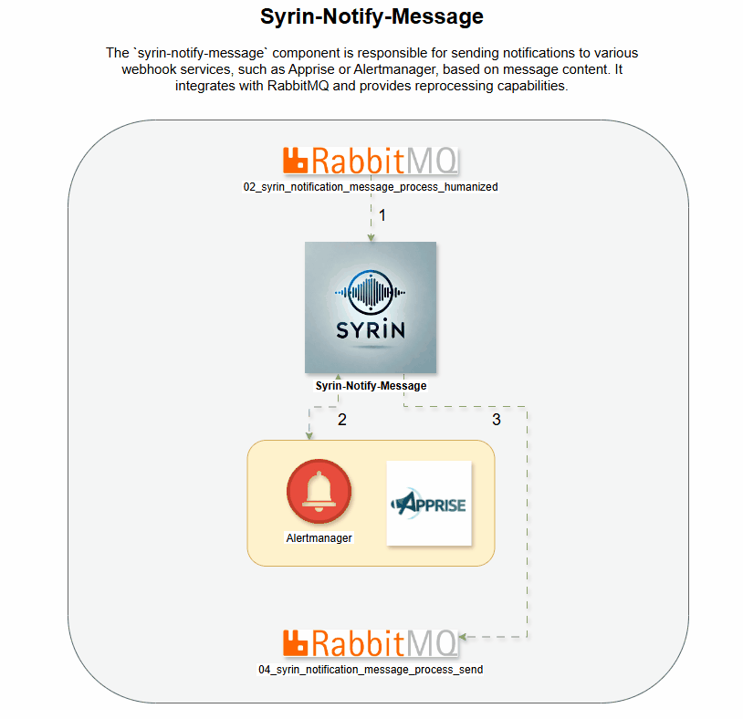

# syrin-notify-message

O componente `syrin-notify-message` é responsável por enviar notificações para vários serviços de webhook, como Apprise ou Alertmanager, com base no conteúdo das mensagens. Ele integra-se ao RabbitMQ e oferece capacidade de reprocessamento.

## Demo

## Tabela de Conteúdos
- [Instalação](#instalação)
- [Variáveis de Ambiente](#variáveis-de-ambiente)
- [Funcionalidade](#funcionalidade)
- [Declarações de Filas](#declarações-de-filas)
- [Logs](#logs)
- [Licença](#licença)

## Instalação

Certifique-se de que o RabbitMQ esteja configurado e acessível. Para detalhes completos de instalação, consulte o [Repositório de Instalação do SYRIN](https://github.com/syrin-alert/syrin-install).

## Variáveis de Ambiente

Defina as seguintes variáveis de ambiente para configurar RabbitMQ e os webhooks:

### Configurações do RabbitMQ

- `RABBITMQ_HOST`: Endereço do servidor RabbitMQ.
- `RABBITMQ_PORT`: Porta para o servidor RabbitMQ (padrão: `5672`).
- `RABBITMQ_VHOST`: Virtual host no RabbitMQ.
- `RABBITMQ_USER`: Nome de usuário para autenticação no RabbitMQ.
- `RABBITMQ_PASS`: Senha para autenticação no RabbitMQ.
- `RABBITMQ_TTL_DLX`: Tempo de vida em ms para a fila de dead-letter (padrão: `60000`).

### Configurações do Webhook

- `WEBHOOK_TYPE`: Tipo de webhook para notificações (`apprise` ou `alertmanager`).
- `WEBHOOK_BASE_URL`: URL base para o serviço de webhook.
- `WEBHOOK_PORT`: Porta para o serviço de webhook.

## Funcionalidade

Este script executa as seguintes tarefas:

1. Conecta-se ao RabbitMQ com as credenciais das variáveis de ambiente.
2. Processa mensagens, formatando-as e enviando-as para o serviço de webhook designado.
3. Redireciona mensagens para reprocessamento se a notificação do webhook falhar.

### Declarações de Filas

As seguintes filas são gerenciadas no RabbitMQ:

- `02_syrin_notification_message_process_humanized`: Processa mensagens de notificação humanizadas.
- `02_syrin_notification_message_reprocess_humanized`: Gerencia reprocessamento para mensagens com falha.
- `04_syrin_notification_message_process_send`: Envia mensagens processadas com sucesso.

## Logs

Os logs estão configurados no nível INFO e os logs da biblioteca `pika` são definidos para WARNING para reduzir a verbosidade.

## Licença

Este projeto está licenciado sob a Licença MIT.
